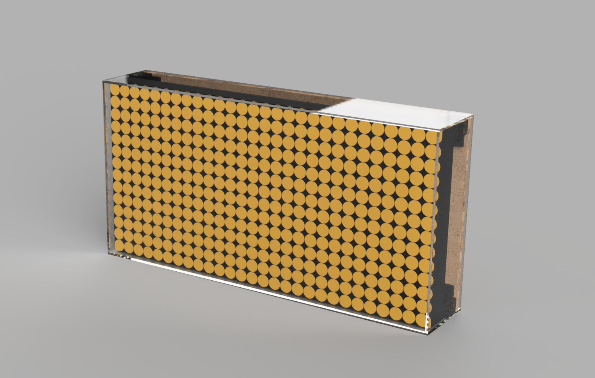

# FlipDot

Three modes:
- Clock, date and temperature.
- Scrolling text
- Remote control over websocket

Startup mode, change mode etc. are handled from a website.
On the website it's possible to select mode, what text to scroll, draw in a canvas that will be mirrored to the display, show gifs (also animated) on the Flip Dot display. The website for control is based on https://github.com/jakkra/WebsocketDisplay.

### Compiling
Follow instruction on [https://github.com/espressif/esp-idf](https://github.com/espressif/esp-idf) to set up the esp-idf, then just run `idf.py build` or use the [VSCode extension](https://github.com/espressif/vscode-esp-idf-extension). Tested with esp-idf 4.1.

