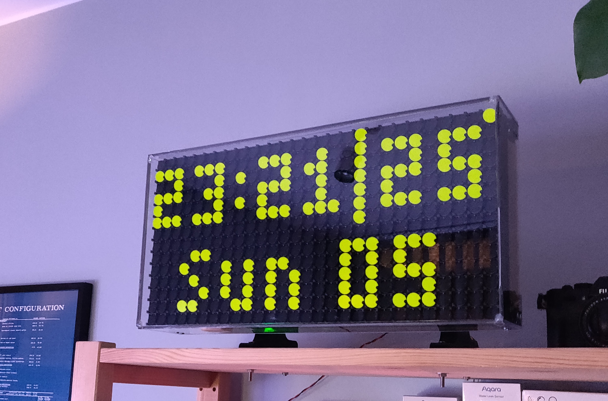
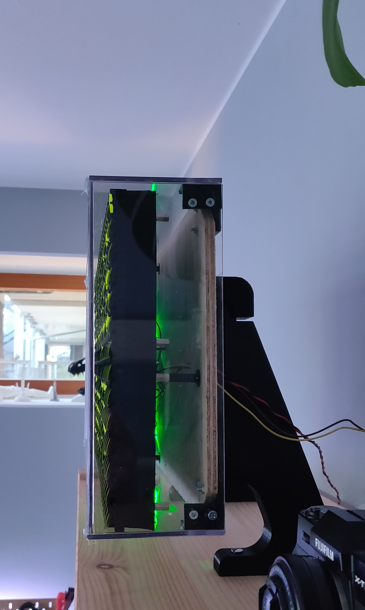
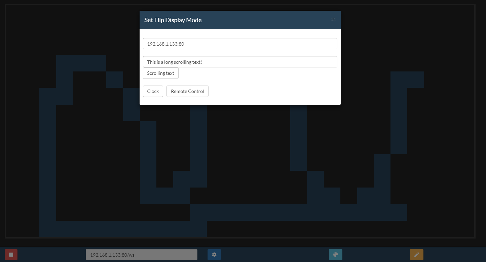
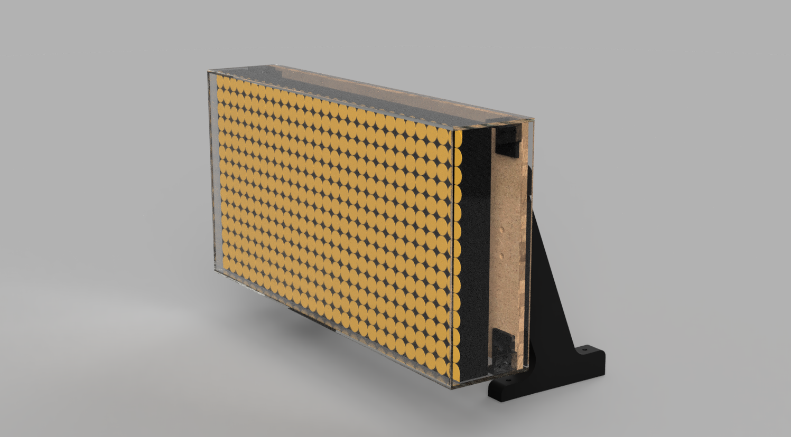

# Flip-Dot Display
Each "pixel" is a physical magnetized disk with two colors, the disks are flipped by change in the magnetic field. This specific display has an (two) on-board controller(s) making controlling it easier, it's just RS-485 and a basic protocol. This is running on an ESP32 with a RS-485 converter.

Implemented so far is three modes:
- Clock, date and temperature (temperature fetched from my Home Assistant setup).
- Display some long scrolling text.
- Remote control over websocket (draw in realtime, render images and gifs etc.)

Startup mode, change mode etc. are handled from a website.
On the website it's possible to select mode, what text to scroll, draw in a canvas that will be mirrored to the display, show gifs (also animated) on the Flip Dot display. The website for control is based on https://github.com/jakkra/WebsocketDisplay.



<p float="left">
  
  
</p>




## Casing
Acrylic sheet to cover the display from dust etc. playwood backplate, some 3D printed brackets and a 3D printed stand.

## Compiling
Follow instruction on [https://github.com/espressif/esp-idf](https://github.com/espressif/esp-idf) to set up the esp-idf, then just run `idf.py build` or use the [VSCode extension](https://github.com/espressif/vscode-esp-idf-extension). Tested with esp-idf 4.3.0.

### Running the website
```
cd client
npm install
npm start
```