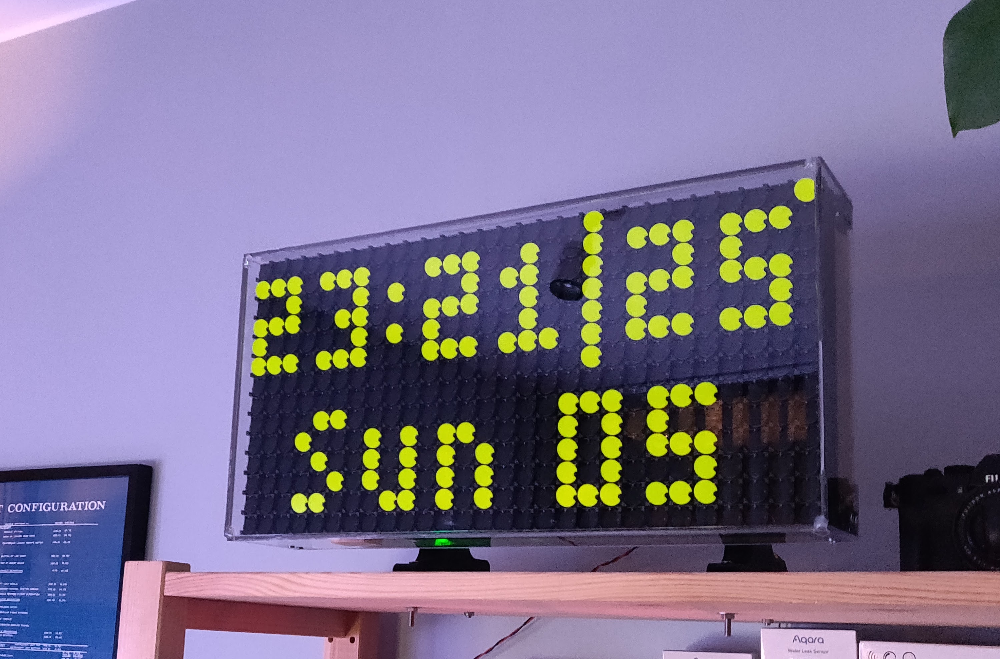
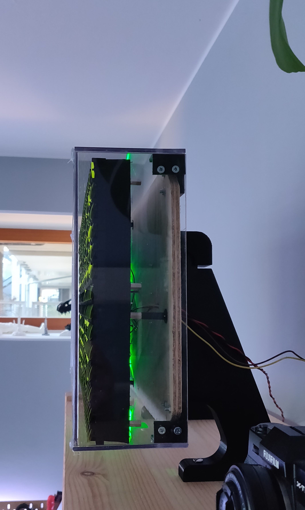
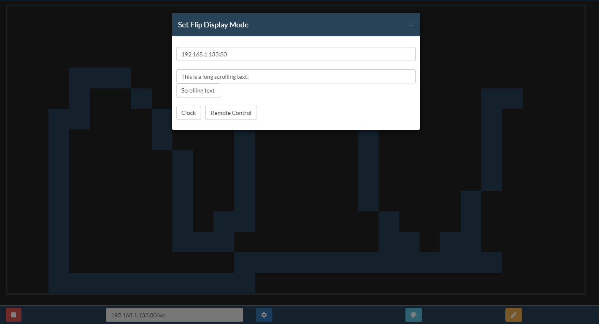
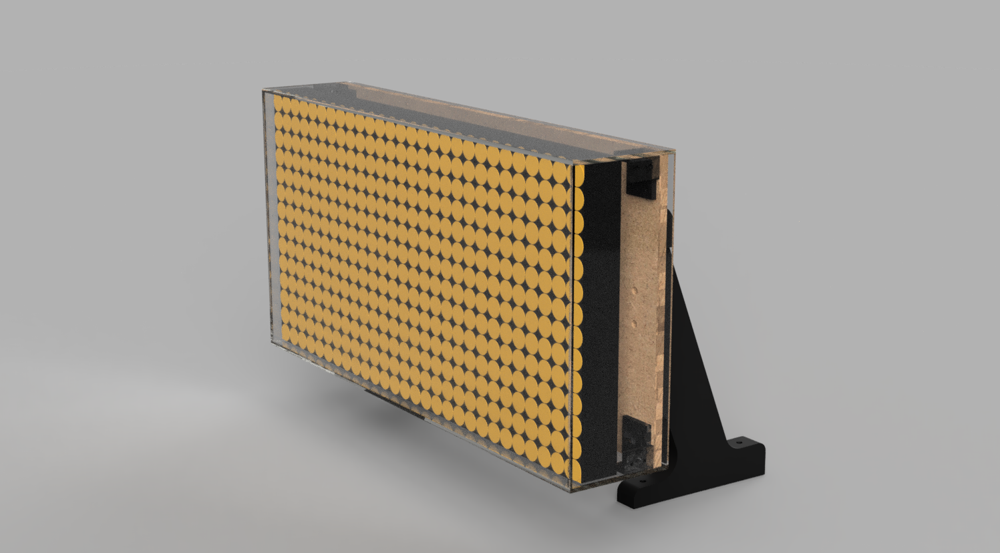

# Flip-Dot Display
Each "pixel" is a physical magnetized disk with two colors, the disks are flipped by change in the magnetic field. This specific display has an (two) on-board controller(s) making controlling it easier, it's just RS-485 and a basic protocol. This is running on an ESP32 with a RS-485 converter.

Implemented so far is three modes:
- Clock, date and temperature (temperature fetched from my Home Assistant setup).
- Display some long scrolling text.
- Remote control over websocket (draw in realtime, render images and gifs etc.)

Startup mode, change mode etc. are handled from a website.
On the website it's possible to select mode, what text to scroll, draw in a canvas that will be mirrored to the display, show gifs (also animated) on the Flip Dot display. The website for control is based on https://github.com/jakkra/WebsocketDisplay.



<p float="left">
  
  
</p>




## Casing
Acrylic sheet to cover the display from dust etc. playwood backplate, some 3D printed brackets and a 3D printed stand.

## Compiling
Follow instruction on [https://github.com/espressif/esp-idf](https://github.com/espressif/esp-idf) to set up the esp-idf, then just run `idf.py build` or use the [VSCode extension](https://github.com/espressif/vscode-esp-idf-extension). Tested with esp-idf 4.3.0.

### Running the website
```
cd client
npm install
npm start
```

## Debugging Without a Display
1. Enable `FlipDot Configuration → Mirror display data to the log for debugging` in `idf.py menuconfig` (or set `CONFIG_FLIP_DOT_DEBUG_UART_OUTPUT=y` in your `sdkconfig`).
2. Rebuild and flash the firmware so the ESP32 emits `DISPLAY_FRAME` log entries with the pixel data.
3. Install the host dependencies once: `pip install pyserial` (Tkinter ships with most Python distributions).
4. Run the viewer while the board is connected, e.g. `python3 tools/flipdot_serial_viewer.py --port /dev/ttyUSB0 --baud 115200`.

The script forwards regular ESP-IDF logs to the terminal and renders the latest frame in a small GUI window so you can verify the output without a physical flip-dot panel.

## Ota update
`python tools/ota_update_cli.py build/flip-dot.bin`

**Example**
```
python3 tools/ota_update_cli.py build/flip-dot.bin
Hosting /home/jakkra/Documents/FlipDot/build/flip-dot.bin on http://0.0.0.0:8000/
Triggering OTA with URL: http://192.168.1.141:8000/flip-dot.bin
Device replied: 202 Accepted
OTA started

Serving firmware for 30 seconds...
192.168.1.133 - - [23/Oct/2025 21:35:50] "GET /flip-dot.bin HTTP/1.1" 200 -
```